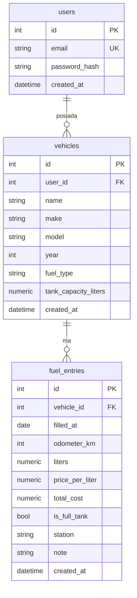

# Dokumentacja projektu — Pojazdy i koszty

**Autorzy:** Anna Kaim 52699, Dawid Miter 52833  
**Stack:** Flutter (aplikacja) · FastAPI (REST API) · PostgreSQL (baza centralna) · SQLite (bufor lokalny)

---

## 1. Ogólne założenia projektu

Celem projektu jest system **mobile-first** do ewidencji pojazdów i kosztów paliwa. Kierowca ma móc szybko zapisać tankowanie **na stacji**, nawet bez sieci, a po odzyskaniu połączenia dane mają trafić na serwer.

Założenia:

- jeden użytkownik może mieć wiele pojazdów (garaż),
- dziennik kosztów przechowuje tankowania i na ich podstawie liczone jest średnie spalanie,
- mapa stacji (OpenStreetMap) ułatwia uzupełnienie lokalizacji wpisu,
- dostęp do API jest chroniony tokenem **JWT**,
- źródłem prawdy po synchronizacji jest **PostgreSQL**; na urządzeniu działa **SQLite** z flagą `is_synced`.

System działa w trzech warstwach:

1. **Aplikacja Flutter** — interfejs, lokalny bufor SQLite, synchronizacja w tle.
2. **Serwer FastAPI** — REST, weryfikacja JWT, walidacja, obliczenia statystyk.
3. **PostgreSQL** — centralna baza użytkowników, pojazdów i tankowań.

---


## 2. Jaki system budujemy

Aplikacja **Pojazdy i koszty** obejmuje trzy moduły zgodne z konspektem:


| Moduł                | Opis                                                                                                                                        |
| -------------------- | ------------------------------------------------------------------------------------------------------------------------------------------- |
| **Garaż**            | CRUD pojazdów: marka, model, rok, typ paliwa, pojemność baku.                                                                               |
| **Dziennik kosztów** | Tankowania: data, licznik, litry, cena za litr, lokalizacja, pełny bak. Backend liczy średnie spalanie z dwóch kolejnych tankowań do pełna. |
| **Znajdź stację**    | Mapa OSM z pobliskimi stacjami (Overpass API). Kliknięcie stacji wstawia adres do nowego tankowania.                                        |


Przepływ danych:

```text
[Formularz tankowania]
        │
        ▼
[SQLite, is_synced = 0]  ──offline OK──► użytkownik wraca do sieci
        │
        ▼  (start aplikacji / zapis / przycisk sync)
[POST/PUT FastAPI + JWT]
        │
        ▼
[PostgreSQL]
        │
        ▼
[GET — dociągnięcie danych z serwera do SQLite, is_synced = 1]
```

---


## 3. Podział zadań w zespole

Projekt wykonały **Anna Kaim** oraz **Dawid Miter**.


| Osoba           | Zakres                                                                                                                                                               |
| --------------- | -------------------------------------------------------------------------------------------------------------------------------------------------------------------- |
| **Anna Kaim**   | Aplikacja Flutter: UI/UX garażu i dziennika, formularze, mapa stacji OSM, lokalna baza SQLite, prezentacja danych z API, obsługa błędów po stronie klienta.          |
| **Dawid Miter** | Backend FastAPI, PostgreSQL, Docker, REST API, JWT, walidacja, statystyki spalania, integracja Overpass (stacje), synchronizacja serwerowa, testy API, dokumentacja. |


Wspólnie: ustalenie konspektu, integracja warstw, przygotowanie demo.

Kontrola wersji: Git (repozytorium projektu `pojazdy-koszty`).

---


## 4. Zastosowane technologie


| Warstwa        | Technologia                            | Zastosowanie                     |
| -------------- | -------------------------------------- | -------------------------------- |
| Frontend       | Flutter / Dart                         | Aplikacja mobilna i web          |
| Stan UI        | Provider                               | Sesja, garaż, sync               |
| Lokalna baza   | SQLite (`sqflite`)                     | Bufor offline, flaga `is_synced` |
| HTTP           | pakiet `http`                          | Klient REST                      |
| Mapa           | `flutter_map`, OpenStreetMap, Overpass | Moduł „Znajdź stację”            |
| Lokalizacja    | `geolocator`                           | Pozycja użytkownika na mapie     |
| Backend        | FastAPI, Uvicorn                       | REST API                         |
| ORM            | SQLAlchemy 2                           | Modele i sesje                   |
| Walidacja      | Pydantic                               | Wejście/wyjście API              |
| Auth           | JWT (PyJWT), PBKDF2                    | Logowanie                        |
| Baza centralna | PostgreSQL 16                          | Dane produkcyjne                 |
| Testy API      | pytest + SQLite w pamięci              | Testy bez Dockera                |
| Konteneryzacja | Docker Compose                         | `db` + `api`                     |
| Zewnętrzne API | Overpass / OSM                         | Pobliskie stacje paliw           |


Uruchomienie stosu serwerowego:

```powershell
docker compose up --build
```

- API: `http://127.0.0.1:8000`
- Interaktywna dokumentacja OpenAPI: `http://127.0.0.1:8000/docs`
- PostgreSQL: `localhost:5432` (użytkownik / hasło / baza: `pojazdy` / `pojazdy` / `pojazdy_koszty`)

Aplikacja:

```powershell
cd mobile
flutter pub get
flutter run -d chrome
```

Na emulatorze Androida adres API to `http://10.0.2.2:8000`, w przeglądarce `http://localhost:8000`.

---


## 5. Dokumentacja API

Base URL: `http://127.0.0.1:8000`  
Format: JSON  
Uwierzytelnianie chronionych zasobów:

```http
Authorization: Bearer <access_token>
```

Typy paliwa: `Benzyna`, `Diesel`, `Benzyna+LPG`, `Hybryda`.

### 5.1. Publiczne (bez tokena)


#### `GET /health`

Sprawdzenie, czy API i baza żyją.

**Odpowiedź 200**

```json
{ "status": "ok", "database": "up" }
```


#### `POST /auth/register`

Rejestracja. Hasło min. 6 znaków.

**Zapytanie**

```json
{ "email": "anna@example.com", "password": "secret1" }
```

**Odpowiedź 201**

```json
{
  "id": 1,
  "email": "anna@example.com",
  "created_at": "2026-09-18T17:00:00Z"
}
```

**Błędy:** `409` — email zajęty, `422` — walidacja.

#### `POST /auth/login`

**Zapytanie**

```json
{ "email": "anna@example.com", "password": "secret1" }
```

**Odpowiedź 200**

```json
{
  "access_token": "eyJhbGciOiJIUzI1NiIsInR5cCI6IkpXVCJ9...",
  "token_type": "bearer"
}
```

**Błąd:** `401` — błędny email lub hasło.

### 5.2. Konto


#### `GET /auth/me`

**Odpowiedź 200** — jak obiekt użytkownika z rejestracji.  
**Błąd:** `401` — brak lub nieważny token.

### 5.3. Pojazdy (garaż)

Wszystkie endpointy poniżej wymagają JWT.

#### `GET /vehicles`

Lista pojazdów zalogowanego użytkownika.

**Odpowiedź 200**

```json
[
  {
    "id": 1,
    "name": "VW Golf",
    "make": "VW",
    "model": "Golf",
    "year": 2018,
    "fuel_type": "Benzyna",
    "tank_capacity_liters": 50.0,
    "created_at": "2026-09-18T17:05:00Z"
  }
]
```


#### `POST /vehicles`

**Zapytanie**

```json
{
  "name": "VW Golf",
  "make": "VW",
  "model": "Golf",
  "year": 2018,
  "fuel_type": "Benzyna",
  "tank_capacity_liters": 50
}
```

**Odpowiedź 201** — obiekt pojazdu.

#### `GET /vehicles/{id}`

**Odpowiedź 200** lub `404`.

#### `PUT /vehicles/{id}`

Częściowa aktualizacja (tylko przesłane pola).

```json
{ "tank_capacity_liters": 55, "fuel_type": "Diesel" }
```


#### `DELETE /vehicles/{id}`

**Odpowiedź 204.** Usuwa też tankowania pojazdu (kaskada).

### 5.4. Dziennik kosztów


#### `GET /vehicles/{id}/fuel-entries`

Lista tankowań (najnowsze pierwsze).

#### `POST /vehicles/{id}/fuel-entries`

Można podać `price_per_liter` **albo** `total_cost` — drugie pole zostanie wyliczone.

**Zapytanie**

```json
{
  "filled_at": "2026-09-10",
  "odometer_km": 100500,
  "liters": 35,
  "price_per_liter": 6.0,
  "is_full_tank": true,
  "location": "Orlen, Długa 1, Gdańsk"
}
```

**Odpowiedź 201**

```json
{
  "id": 2,
  "vehicle_id": 1,
  "filled_at": "2026-09-10",
  "odometer_km": 100500,
  "liters": 35.0,
  "price_per_liter": 6.0,
  "total_cost": 210.0,
  "is_full_tank": true,
  "location": "Orlen, Długa 1, Gdańsk",
  "station": "Orlen, Długa 1, Gdańsk",
  "note": null
}
```

**Błędy:** `400` — licznik mniejszy niż przy poprzednim wpisie, `409` — ten sam licznik już istnieje, `404` — brak pojazdu.

#### `PUT /fuel-entries/{id}` / `DELETE /fuel-entries/{id}`

Aktualizacja i usunięcie wpisu (`204` przy DELETE).

#### `GET /vehicles/{id}/stats`

Obliczenia po stronie serwera. Średnie spalanie: litry z tankowania do pełna dzielone przez dystans od poprzedniego pełnego baku, wynik w l/100 km.

**Odpowiedź 200**

```json
{
  "vehicle_id": 1,
  "fillup_count": 2,
  "total_cost": 450.0,
  "total_liters": 75.0,
  "total_distance_km": 500,
  "avg_consumption_l_per_100km": 7.0,
  "cost_per_km": 0.9,
  "avg_price_per_liter": 6.0
}
```

Gdy jest mniej niż dwa pełne tankowania, `avg_consumption_l_per_100km` wynosi `null`.

### 5.5. Stacje (OSM)


#### `GET /stations/nearby?lat=54.35&lon=18.65&radius_m=5000`

Wymaga JWT. Serwer odpytuje Overpass (OpenStreetMap) o węzły `amenity=fuel`.

**Odpowiedź 200**

```json
{
  "stations": [
    {
      "id": "123",
      "name": "Orlen",
      "lat": 54.352,
      "lon": 18.646,
      "address": "Orlen, Długa 1, Gdańsk",
      "distance_km": 0.41
    }
  ]
}
```

**Błąd:** `502` — Overpass niedostępny.

### 5.6. Kody błędów (skrót)


| Kod | Znaczenie                               |
| --- | --------------------------------------- |
| 400 | Niepoprawna logika (np. licznik wstecz) |
| 401 | Brak logowania / zły token / złe hasło  |
| 404 | Brak zasobu albo cudzy pojazd           |
| 409 | Konflikt (email, ten sam licznik)       |
| 422 | Błąd walidacji JSON                     |
| 502 | Błąd zewnętrznego API OSM               |
| 503 | Baza niedostępna (`/health`)            |


Aplikacja mapuje te kody na komunikaty w UI (`ApiException`). Brak sieci: zapis zostaje w SQLite z `is_synced = 0`.

---


## 6. Schemat bazy danych


### 6.1. PostgreSQL (baza centralna)

Relacja: **User 1 — N Vehicle 1 — N FuelEntry**.




Ograniczenia:

- `users.email` — unikalny,
- `vehicles.user_id` → `users.id` (`ON DELETE CASCADE`),
- `fuel_entries.vehicle_id` → `vehicles.id` (`ON DELETE CASCADE`),
- unikalność `(vehicle_id, odometer_km)` — jedno tankowanie na dany stan licznika.

Pole `station` w PostgreSQL przechowuje **lokalizację** (adres z mapy lub wpis ręczny). API zwraca je jako `location` i `station`.

### 6.2. SQLite (bufor na urządzeniu)

Tabele `vehicles` i `fuel_entries` z kluczami lokalnymi oraz kopią identyfikatorów serwera.


| Kolumna      | Rola                                                |
| ------------ | --------------------------------------------------- |
| `local_id`   | Klucz lokalny (PK)                                  |
| `server_id`  | ID z PostgreSQL (null, dopóki nie zsynchronizowano) |
| `is_synced`  | `0` = czeka na wysłanie, `1` = zgodne z serwerem    |
| `is_deleted` | miękkie usunięcie do czasu sync                     |
| `updated_at` | znacznik zmian                                      |


Synchronizacja przy starcie (po zalogowaniu) i po zapisie:

1. wyślij rekordy z `is_synced = 0` (create/update/delete),
2. pobierz aktualny stan z API,
3. zapisz lokalnie z `is_synced = 1`.

Dzięki temu tankowanie na stacji bez internetu trafia najpierw do SQLite, a po odzyskaniu sieci — do PostgreSQL.

---


## 7. Testy

Testy funkcjonalne API (SQLite, bez Dockera):

```powershell
cd backend
.\.venv\Scripts\Activate.ps1
pytest -q
```

Pokrywają m.in. rejestrację/logowanie, CRUD pojazdów, tankowania, spalanie 7,0 l/100 km oraz parser stacji OSM.

---

